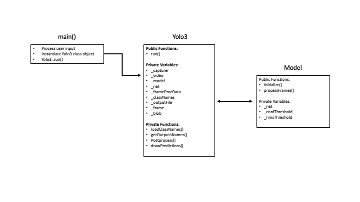

# YOLOv3 Object Detection using OpenCV

This project is the Capstone Project for the [Udacity C++ Nanodegree Program](https://www.udacity.com/course/c-plus-plus-nanodegree--nd213). It detects up to 80 classes of objects from a sequence of frames using the You Only Look Once (YOLOv3) Deep Neural Network, originally authored by Joseph Redmon and Ali Farhadi. YOLOv3 forwards the the whole image, or frame, at once saving valuable inference time. It divides the image into a 13x13 grid of cells. Each cell is responsible for predicting a number of bounding boxes in the image. For each bounding box, the network predicts the confidence that the bounding box encloses an object, and outputs the probability that the object represents a particular class. Using non-maximum suppression the bounding boxes with low confidence scores (0.5) are eliminated. This technique yields surprisingly fast results.

This project also aims to demonstrate the use of modern Object Oriented Programming in C++ with the features such as smart pointers, and the rule-of-five. 


## Dependencies for Running Locally
The following dependencies are required to run the program locally.
* cmake >= 3.17
  * All OSes: [click here for installation instructions](https://cmake.org/install/)
* make >= 4.3 (Linux, Mac)
  * Linux: make is installed by default on most Linux distros
  * Mac: [install Xcode command line tools to get make](https://developer.apple.com/xcode/features/)
* OpenCV >= 4.5
  * The OpenCV 4.5 source code can be found [here](https://github.com/opencv/opencv/tree/4.1.0)
* gcc/g++ >= 5.4
  * Linux: gcc / g++ is installed by default on most Linux distros
  * Mac: same deal as make - [install Xcode command line tools](https://developer.apple.com/xcode/features/)
* NOTE: This project is tested using Mac OSX 10.15

## Build Instructions

1. Clone the repository and navigate to the downloaded folder.
	
	```	
		git clone https://github.com/justinbellucci/yolo3-object-detection.git
		cd yolo3-object-detection
	```
2. Download the models and note the path to each file.
    ```	
		sudo chmod a+x getModels.sh
        ./getModels.sh
	```
3. Make a build directory in the top level directory:   
    ```
        mkdir build && cd build
    ```
3. Compile 
    ```
        cmake .. 
        make
    ```
## Running the Program
The input to this program can be either a mp4 video file or a webcam. Once run, a window will open and the video will play automatically. Once finished, the program will terminate the window.
1. Video file:

    ```
    ./yolo3_detector --video=/my_video.mp4 --config=/yolov3.cfg --weights=/yolov3.weights --names=/coco.names
    ```
2. Webcam

    ```
    ./yolo3_detector --config=/yolov3.cfg --weights=/yolov3.weights --names=/coco.names
    ```

## Class Structure


## Rubric Points 
### Loops, Functions, I/O

| Point                                                                                          | File       | Lines          |
|------------------------------------------------------------------------------------------------|------------|----------------|
| The project demonstrates an understanding of C++ functions and control structures.             | all        | -              |
| The project reads data from a file and process the data, or the program writes data to a file. | [main.cpp] | 25 - 27        |
| The project accepts user input and processes the input.                                        | [main.cpp] | 10, 24         |

### Object Oriented Programming
| Point                                                                                         | File        | Lines          |
|-----------------------------------------------------------------------------------------------|-------------|----------------|
| The project uses Object Oriented Programming techniques.                                      | all         | -              |
| Classes use appropriate access specifiers for class members.                                  | [yolo3.h]   |                |
| Class constructors utilize member initialization lists.                                       | [yolo3.cpp] | 6              |
| Classes encapsulate behavior.                                                                 | [yolo3.h]   | 41 - 44        |
### Memory Management

| Point                                                                                         | File        | Lines          |
|-----------------------------------------------------------------------------------------------|-------------|----------------|
| The project makes use of references in function declarations.                                 | all         | -              |
| The project uses destructors appropriately.                                                   | [model.cpp] | 16             |
| The project follows the Rule of 5.                                                            | [model.cpp] | 6 - 42         |
| The project uses move semantics to move data, instead of copying it, where possible.          | [main.cpp]  | 8, 25, 38      |              
| The project uses smart pointers instead of raw pointers.                                      | [yolo3.cpp] | 24             |

[main.cpp]: src/main.cpp
[yolo3.cpp]: src/yolo3.cpp
[yolo3.h]: include/yolo3.h
[model.cpp]: src/model.cpp
[model.h]: include/model.h
